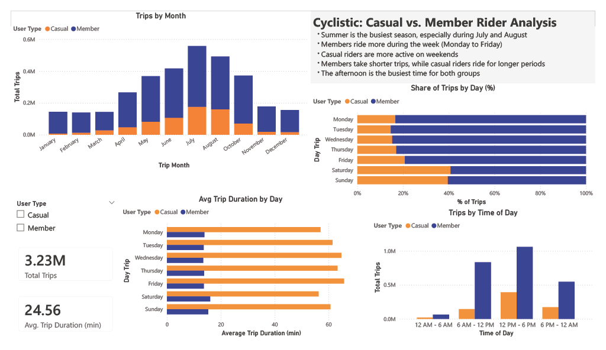

## Project Overview

Cyclistic is a bicycle-sharing company operating in Chicago, with more than 5,800 bicycles and 600 docking stations.

The objective of this project is to answer the question:  
**How do annual members and casual riders use Cyclistic bikes differently?**

Before that, here is how each type of rider is defined:

- **Member:** a person who uses the bikes frequently and pays an annual membership for unlimited access.
- **Casual:** a person who uses the bikes for a short period, such as a single ride or a day pass. These are usually tourists or occasional users.

From a business perspective, the goal is to identify patterns in rider behavior and find ways to convert casual riders into annual members.

---

## Data Preparation

The data is publicly available and organized into fields (columns) and records (rows). It covers the period from April 2019 to March 2020.

I explored the data to understand the variables and overall structure, making sure everything was accurate and consistent. The project is based on four quarters:

- Q2 2019 (April–June)  
- Q3 2019 (July–August)  
- Q4 2019 (October–December)  
- Q1 2020 (January–March)

### Observations
- In Q2 2019, the last recorded date is June 27th, so three days are missing  
- There is no data available for September  
- A total of 3,228,091 trips were analyzed  

---

## Data Cleaning & Processing

The first step was cleaning the data in Excel.

- Removed latitude and longitude since they were only available for one quarter  
- Removed the `rideable_type` field because there was only one bike type  
- Standardized values:
  - “Subscriber” → “Member”
  - “Customer” → “Casual”
- Renamed columns:
  - “from” → “Start”
  - “to” → “End”
- Sorted dates in Q1 2020 to match the other datasets  

After cleaning, I combined all datasets using **Power Query** due to Excel row limitations.

Finally, I used **Power BI** to create DAX measures and build the interactive dashboard.

## Dashboard

---

## Key Findings

- Summer is the busiest season, especially July and August  
- Members are more active from Monday to Friday  
- Casual riders are more active on weekends  
- Members ride more often, but for shorter periods  
- Casual riders take fewer trips, but ride longer  
- The afternoon (12 PM–6 PM) is the busiest time for both groups  

---

## Conclusion

There is a clear difference between casual and member riders.

Members tend to ride more frequently during the week and for shorter periods (around 14 minutes), likely for daily routines such as going to the gym. However, casual riders are more active on weekends and ride for longer periods (around 1 hour), which suggests leisure or tourism activities.

These patterns show that converting casual riders into members could reduce maintenance needs and increase overall profitability, while also improving bike availability.

